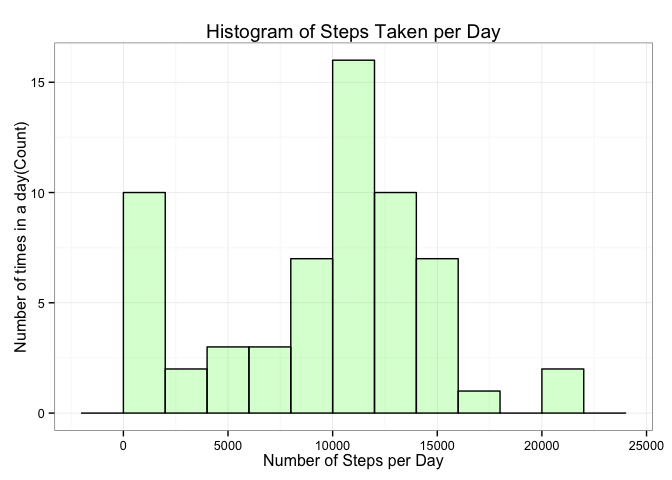
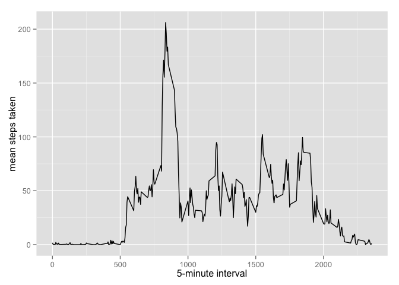
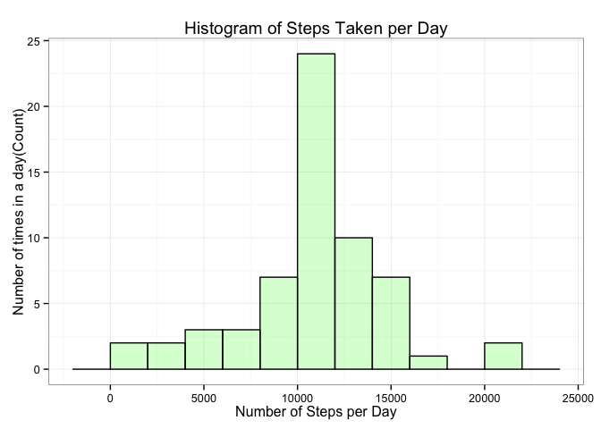
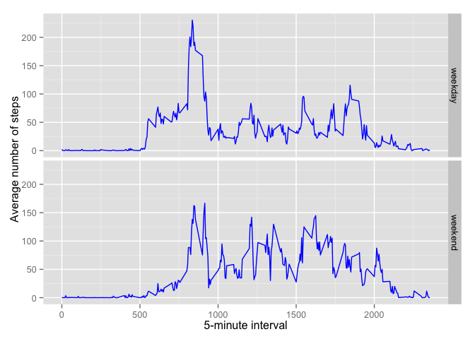

# Reproducible Research: Peer Assessment 1

## Load some libraries

We will be using dplyr and ggplot libraries


```r
require(dplyr) # for cleaning up data
require(ggplot2) # for the graphics
```

## Loading and preprocessing the data

The data is present in the `activity.zip` file. So, we first read the `activity.csv` within this zip file and load it into a variable called `rawData`.


```r
rawData <- read.csv(unz("activity.zip", "activity.csv"))
rawData <- tbl_df(rawData) %>% mutate(date = as.Date(date))
```

## What is mean total number of steps taken per day?

To calculate the mean total number of steps per day, we will first project only the `steps` and `date` columns. Then get the total number of steps per day we will group the rows by the date column and add up all the values for the steps column.


```r
stepsPerDay <- rawData %>% 
                      select(date, steps) %>% 
                      group_by(date) %>% 
                      summarise(steps = sum(steps, na.rm = TRUE))
```

Next, we calculate the histogram of total number of steps taken each day.


```r
ggplot(data=stepsPerDay, aes(x = steps)) + 
  geom_histogram(binwidth = 2000, col="black", fill="green", alpha = .2) + 
  labs(title="Histogram of Steps Taken per Day", 
       x = "Number of Steps per Day", 
       y = "Number of times in a day(Count)") + 
  theme_bw() 
```

 

And, then we calculate the mean and median steps taken per day.


```r
meanStepsPerDay <- mean(stepsPerDay$steps, na.rm = TRUE)
medianStepsPerDay <- median(stepsPerDay$steps, na.rm = TRUE)
```

This comes out to be 9354.22951 and 10395 as the mean and median respectively.

## What is the average daily activity pattern?

We then calculate the average steps taken at a five minute interval every day.


```r
dailyActivity <- rawData %>% 
                    group_by(interval) %>% 
                    summarize(meanSteps = mean(steps, na.rm = TRUE))

intervalMax <- filter(dailyActivity, meanSteps == max(meanSteps))
maxIntervalSteps <- intervalMax$meanSteps

str(dailyActivity)
```

```
## Classes 'tbl_df', 'tbl' and 'data.frame':	288 obs. of  2 variables:
##  $ interval : int  0 5 10 15 20 25 30 35 40 45 ...
##  $ meanSteps: num  1.717 0.3396 0.1321 0.1509 0.0755 ...
##  - attr(*, "drop")= logi TRUE
```

Then we plot a line chart of the data to depict the five-minute patterns.


```r
ggplot(data=dailyActivity, aes(x=interval, y=meanSteps)) +
  geom_line() +
  xlab("5-minute interval") +
  ylab("mean steps taken")
```

 

The interval 835 with 206.1698113 has the highest mean step count.


## Imputing missing values


```r
totalCount <- length(rawData$steps)
naCount <- sum(is.na(rawData$steps))
```

From the complete dataset with 17568 observations `naCount` are missing step counts.

To account for the missing data we will use they will be replaced by the interval averages.


```r
patchedData <- rawData %>%
  left_join(dailyActivity, by = "interval") %>%
  mutate(steps = ifelse(is.na(steps), meanSteps, steps)) %>%
  select(date, interval, steps)
```

Now, we can do the same analysis as before (construct a histogram on the steps taken each day with the replacement).


```r
stepsPerDay2 <- patchedData %>% 
                      group_by(date) %>% 
                      summarise(steps = sum(steps, na.rm = TRUE))
```


```r
ggplot(data=stepsPerDay2, aes(x = steps)) + 
  geom_histogram(binwidth = 2000, col="black", fill="green", alpha = .2) + 
  labs(title="Histogram of Steps Taken per Day", 
       x = "Number of Steps per Day", 
       y = "Number of times in a day(Count)") + 
  theme_bw() 
```

 

And, then we re-calculate the mean and median steps taken per day.


```r
meanStepsPerDay2 <- mean(stepsPerDay2$steps, na.rm = TRUE)
medianStepsPerDay2 <- median(stepsPerDay2$steps, na.rm = TRUE)
```

This comes out to be 10766.1887 and 10766.1887 as the mean and median respectively.

## Are there differences in activity patterns between weekdays and weekends?

First, we create a new factor variable in the dataset with two levels – "weekday" and "weekend" indicating whether a given date is a weekday or weekend day.


```r
stepsPerDayWithDayType <- patchedData %>% 
  mutate(day = weekdays(date)) %>%
  mutate(day = ifelse(day == "Saturday"|day == "Sunday", "weekend", "weekday")) %>%
  mutate(day = as.factor(day))

str(stepsPerDayWithDayType)
```

```
## Classes 'tbl_df', 'tbl' and 'data.frame':	17568 obs. of  4 variables:
##  $ date    : Date, format: "2012-10-01" "2012-10-01" ...
##  $ interval: int  0 5 10 15 20 25 30 35 40 45 ...
##  $ steps   : num  1.717 0.3396 0.1321 0.1509 0.0755 ...
##  $ day     : Factor w/ 2 levels "weekday","weekend": 1 1 1 1 1 1 1 1 1 1 ...
```

Lastly, we create a panel plot containing a time series plot (i.e. type = "l") of the 5-minute interval (x-axis) and the average number of steps taken, averaged across all weekday days or weekend days (y-axis).


```r
stepMeanByDayType <- stepsPerDayWithDayType %>% 
                        group_by(day, interval) %>% 
                        summarize(stepMean=mean(steps))
```

Finally, depicting as a time series panel plot.


```r
ggplot(stepMeanByDayType, aes(interval, stepMean)) + 
  geom_line(col = "blue") + 
  facet_grid(day ~ .) +
  xlab("5-minute interval") + 
  ylab("Average number of steps")
```

 
